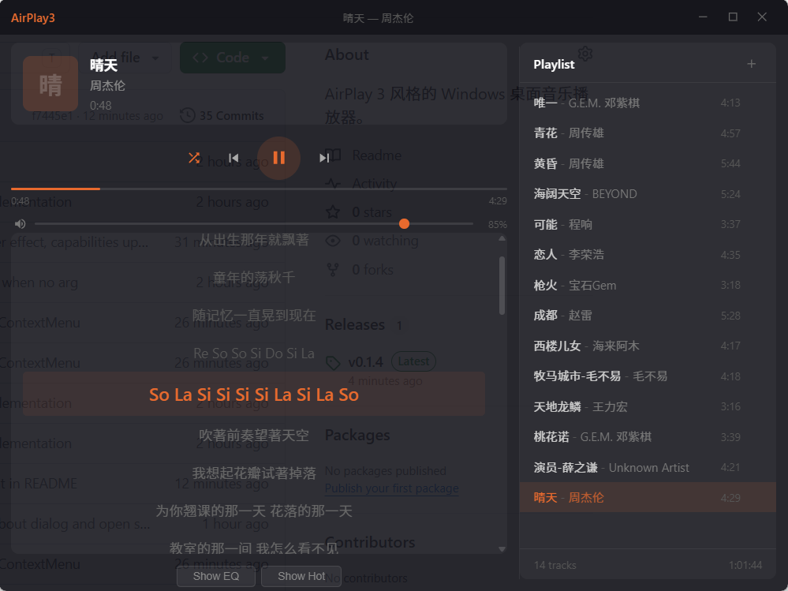

# AirPlay3

AirPlay 3 风格的 Windows 桌面音乐播放器。



## 技术栈

- **Frontend**: Tauri 2 + Vue 3 + TypeScript + Vite + Pinia
- **Backend**: Rust + Tauri Commands
- **Testing**: Vitest + Playwright

## 功能特性

### 播放器核心
- 本地音乐播放（MP3/WAV/FLAC/OGG/AAC/M4A/WMA/OPUS）
- 拖拽文件添加到播放列表
- 文件选择器添加音乐
- 读取音乐文件元数据（歌手、标题、专辑）
- 播放/暂停/上一首/下一首
- 进度条拖拽定位
- 音量调节
- 顺序/随机播放模式

### 歌词系统
- 在线歌词自动获取（LRCLIB API）
- 繁体转简体（zhconv）
- 歌词缓存到本地
- 同步滚动高亮显示

### 音频均衡器
- 10 段 EQ（32Hz ~ 16KHz）
- 预设模式（Flat/Rock/Pop/Jazz/Classical/Bass/Treble/Vocal）
- ON/OFF 开关
- EQ 设置持久化

### 在线音乐
- 热门歌曲列表（gequhai.com）
- 10 页分页自动加载
- 在线下载缓存到本地
- 已下载标记

### 数据持久化
- 播放列表保存到 `~/.airplay3/playlist.json`
- 播放状态保存到 `~/.airplay3/state.json`（当前歌曲/音量/随机模式/播放进度）
- 歌词缓存到 `~/.airplay3/lyrics/`
- 音频缓存到 `~/.airplay3/cache/`
- EQ 设置保存到 `~/.airplay3/eq.json`

### 界面
- 无边框透明窗口
- 自定义标题栏（最小化/最大化/关闭）
- 左右分栏布局
- 半透明面板（标题栏 70% / 内容区 90%）
- 橙色主题高亮
- EQ 和在线音乐面板可折叠

## 开发

```bash
# 安装依赖
pnpm install

# 启动开发服务器
pnpm tauri dev

# 运行前端测试
pnpm test

# 运行 Rust 测试
cd src-tauri && cargo test

# 运行 E2E 测试
pnpm test:e2e
```

## 项目结构

```
airplay3/
├── src/                          # Vue 3 前端
│   ├── App.vue                   # 主布局
│   ├── main.ts                   # 入口
│   ├── stores/
│   │   └── player.ts             # Pinia 播放器状态
│   ├── composables/
│   │   ├── useAudioEngine.ts     # 音频引擎
│   │   ├── useEqualizer.ts       # 均衡器
│   │   ├── useLyrics.ts          # 歌词引擎
│   │   └── useSpectrum.ts        # 频谱分析
│   ├── services/
│   │   └── lyrics.ts             # 歌词获取服务
│   ├── utils/
│   │   └── eventBus.ts           # 事件总线
│   ├── components/
│   │   ├── TitleBar.vue          # 标题栏
│   │   ├── SongInfo.vue          # 歌曲信息
│   │   ├── PlayerControls.vue    # 播放控制
│   │   ├── ProgressBar.vue       # 进度条
│   │   ├── VolumeControl.vue     # 音量控制
│   │   ├── PlaylistPanel.vue     # 播放列表
│   │   ├── LyricsDisplay.vue     # 歌词显示
│   │   ├── EqPanel.vue           # 均衡器面板
│   │   └── OnlineMusic.vue       # 在线音乐
│   └── types/
│       ├── player.ts             # 播放器类型
│       └── skin.ts               # 皮肤类型
├── src-tauri/                    # Rust 后端
│   ├── Cargo.toml
│   ├── tauri.conf.json
│   ├── capabilities/
│   │   └── default.json
│   └── src/
│       ├── lib.rs
│       ├── main.rs
│       ├── commands/
│       │   ├── mod.rs
│       │   ├── persistence.rs    # 数据持久化
│       │   ├── lyrics.rs         # 歌词获取
│       │   ├── metadata.rs       # 音乐元数据
│       │   ├── online.rs         # 在线音乐
│       │   ├── player.rs         # 播放器状态
│       │   └── window.rs         # 窗口控制
│       └── tray/
│           └── mod.rs            # 系统托盘
└── tests/
    ├── unit/                     # 单元测试
    └── e2e/                      # E2E 测试
```

## 测试覆盖

- **前端单元测试**: 105 个（Vitest）
- **Rust 单元测试**: 16 个（cargo test）
- **E2E 测试**: 12 个（Playwright）

## 数据目录

所有用户数据保存在 `~/.airplay3/`：

```
~/.airplay3/
├── playlist.json      # 播放列表
├── state.json         # 播放状态
├── volume.txt         # 音量设置
├── eq.json            # 均衡器设置
├── lyrics/            # 歌词缓存
│   └── *.json
└── cache/             # 在线音乐缓存
    └── *.mp3
```

## Acknowledgments

本项目使用 [MiMoCode](https://github.com/XiaomiMiMo/MiMo-Code) 辅助开发，感谢 MiMo 团队提供的免费 mimo-v2.5 模型 token。

## License

MIT
